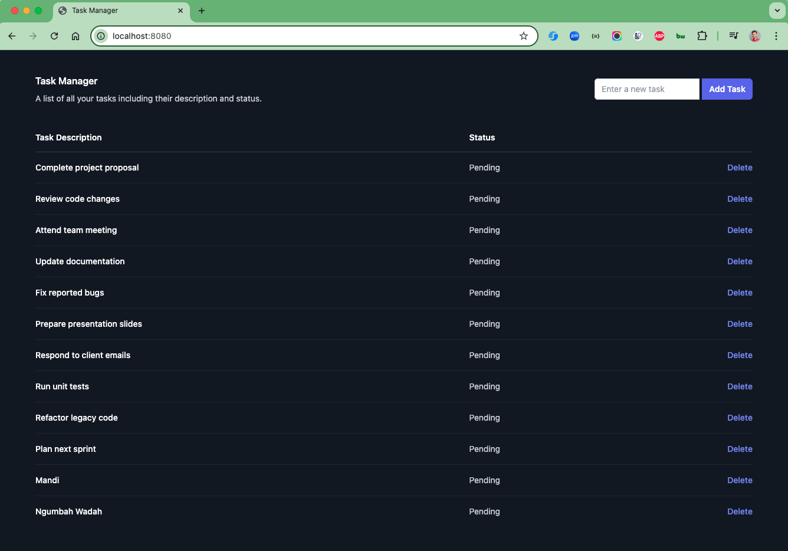

# Spring Boot & JTE & HTMX Tasks

This project demonstrates a simple task management application built with Spring Boot, JTE (Java Template Engine), and HTMX. It showcases how to create a responsive web application with server-side rendering and dynamic updates.

## Technologies Used

- Java 23
- Spring Boot 3.3.4
- JTE (Java Template Engine)
- HTMX (for dynamic frontend updates)
- Maven (for dependency management and build)

### Things todo list

1. Clone this repository: `git clone https://github.com/hendisantika/spring-boot-jte-task.git`
2. Navigate to the folder: `cd spring-boot-jte-task`
3. Run the application: `mvn clean spring-boot:run`
4. Open your favorite browser: http://localhost:8080

### Image Screen shot

Home Page

